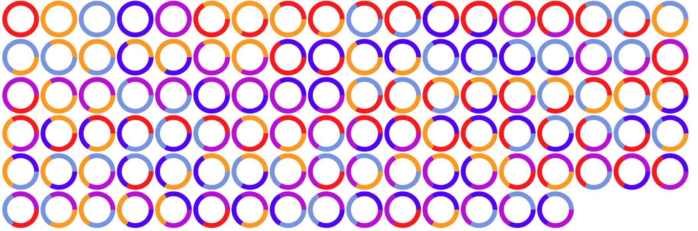

# emojihash
secure emojihash map for hex strings
```
$ python3 main.py B8B92Cc1Fbe8E425184769B296BAD43245Ad2C84
> 🌙🔕🏒🍝🥁🏟🐽😳🌲🏈🍁🕘👶😠🧸💙
```

# Colored circles

Check out the web demo in circle_web for an interactive example. All you need to do is open
[index.html](circle_web/index.html) in a web browser.

Example with 105 circles and parameters length N=3, colors C=5 and 1 to 3 segments K.



A python library is also available to generate the data for these colored circles easily.
To use it, just put [color_circles.py](color_circles.py) in the same directory as your python file.

Example python code.
```python
from color_circles import ColoredCircles

pieces = 6 # pieces of the circle
segments = 6 # segments to group pieces into
colors = 8 # number of colors we have to color the segments
colored_circles = ColoredCircles(pieces, range(1, segments + 1), colors)

colored_circles.index_to_circle(1234)
# ((1, 4, 1), (6, 4, 1))
# Here we have 3 segments of 1, 4, and 1 piece lengths.
# Their colors are the 6th, 4th, and 1st colors out of 8.
# We could now use this to make an svg of a circle.
```

## High level description of algorithm


# Parameter analysis


This repository uses [famed](https://famed.morphysm.com/boards/0kok0/emojihash) to reward contributions. Visit https://www.famed.morphysm.com to learn more about how to get famed or get in touch: contact@morphysm.com
